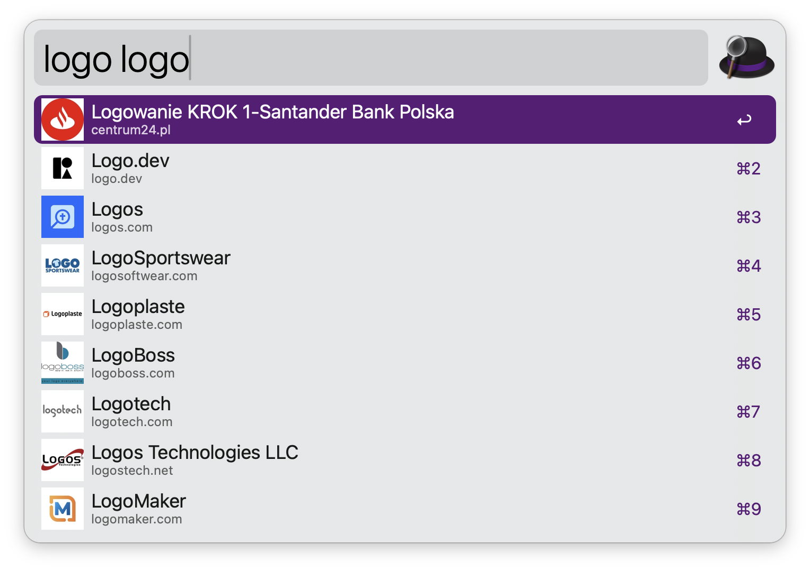

# logo.dev search workflow

Workflow to search for logos at [logo.dev][1].

## Prerequisites
To be able to use this workflow you need an account at [logo.dev][1] and enter your secret key during configuration of the workflow.

## Usage
Open the Alfred search bar and type `logo` and a search term and it will fetch the results and show the coresponding logos. Press enter to copy the url to the clipboard.

[1]:https://logo.dev/